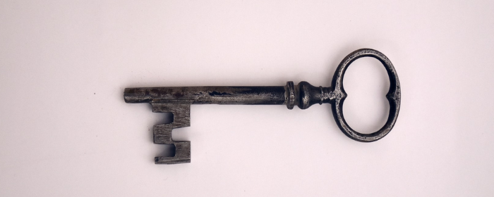

```{r setup, include=FALSE}
knitr::opts_chunk$set(echo = F,
                      cache = T,
                      cache.lazy = F)
library(pacman)
p_load(tidyverse, tidytext, tm, quanteda,
       knitr, kableExtra, rio, extrafont,
       cowplot)
```


<mark>[Click here](https://www.texasstandard.org/stories/change-human-and-truth-how-a-presidents-unique-inaugural-word-choices-reflect-the-world-as-it-is/) to listen to the Texan Translation segment on KUT Public Radio in which the research presented here was discussed (aired on 22 January, 2021).</mark>

{width="60%"}

```{r load-data}
corpus <- import("../../data/corpus.RDS")
```


## Most frequent words

For the first analysis we'll remove stopwords (see a [definition of stopwords here](https://en.wikipedia.org/wiki/Stop_word)). And then we will count the occurrences of each distinct word and see what's most frequent!

```{r make-plots}
pal <- wesanderson::wes_palette("Zissou1", 5, 
                                type="continuous")

inaugurals_words <- 
  corpus %>% 
  unnest_tokens(word, text) %>% 
  mutate(word = recode(word,
                       `america's` = "america",
                       american = "america",
                       americans = "america",
                       mine = "my",
                       `other's` = "other")) %>% 
  count(doc_id, word, sort = T)

inaugurals_total_n <- 
  inaugurals_words %>% 
  group_by(doc_id) %>% 
  summarize(total = sum(n))

inaugurals_words <- 
  inaugurals_words %>% 
  left_join(inaugurals_total_n)

inaugurals_toplot <- inaugurals_words %>%
  #bind_tf_idf(word, author, n) %>%
  filter(!word %in% stop_words$word) %>% 
  mutate(
    freq = n/total,
    nwords = n
    )

docs <- inaugurals_toplot %>% 
  pull(doc_id) %>% 
  as.character() %>% 
  unique()

docs <- docs[c(4,5,3,2,1)]

pfunct <- 
  function(dat, i){ 
  dat %>%
    filter(doc_id == 
           docs[i]) %>% 
    head(15) %>% 
    #mutate(word = reorder(word, freq)) %>%
    ggplot(aes(x = reorder(word, nwords), 
               y = nwords)) +
    geom_col(show.legend = FALSE,
             width = 0.45,
             fill = pal[i]) +
    coord_flip() +
    labs(x = "", y = "freq",
         title = docs[i]) +
    theme_bw(base_family = "Volkhov-Regular",
                  base_size = 10) +
    theme(plot.title = element_text(size=9,
                                    face="bold"),
          axis.title = element_text(size=6),
          axis.text.x = element_blank(),
          panel.grid.major.x = element_blank(),
          #panel.grid.minor.x = element_blank(),
          panel.grid.major.y = element_blank(),
          panel.grid.minor.x = element_blank())
}

```

```{r printplots1-5, layout="l-body-outset", fig.height=5, fig.cap="Top 15 terms in each inaugural address by frequency."}
p1 <- pfunct(inaugurals_toplot, 1)
p2 <- pfunct(inaugurals_toplot, 2)
p3 <- pfunct(inaugurals_toplot, 3)
p4 <- pfunct(inaugurals_toplot, 4)
p5 <- pfunct(inaugurals_toplot, 5)
g1 <- plot_grid(p1, p2, NULL, p3, p4, p5, nrow=2)
g2 <- g1 %>% 
  add_sub("www.texasenglish.org",
          x = 1, hjust = 1,
          fontfamily="Volkhov-Regular",
          size=6)
ggdraw(g2)
```

## Most important words by tf-idf

An advanced measure of the importance of words in documents is `tf-idf`. It is calculated using a formula that takes into account both each word's raw frequency as well as the number of documents in the corpus in which it is used. This method is a way of finding out **the most distinctive words in each text**.

<aside>`tf-idf` is defined in detail [here](https://en.wikipedia.org/wiki/Tf%E2%80%93idf).</aside>

For example, in the context at hand, you might expect that each of the four speeches contains the words *freedom* or *people*. And while it is certainly interesting which president used them the most, these words aren't really distinctive, simply because each president uses them on this occasion. But it's instructive to look at the words that are *both frequent and unique* to each speech.

```{r}
inaugurals_tf_idf <- 
  inaugurals_words %>%
  bind_tf_idf(word, doc_id, n) %>% 
  select(-total) %>%
  anti_join(stop_words) %>% 
  arrange(desc(tf_idf))
```

```{r tf-idf}
pfunct2 <- 
  function(dat, i){ 
  dat %>%
    filter(doc_id == 
           docs[i]) %>% 
    head(15) %>% 
    ggplot(aes(x = reorder(word, tf_idf), 
               y = tf_idf)) +
    geom_col(show.legend = FALSE,
             width = 0.45,
             fill = pal[i]) +
    coord_flip() +
    labs(x = "", y = "tf_idf",
         title = docs[i]) +
    theme_bw(base_family = "Volkhov-Regular",
                  base_size = 10) +
    theme(plot.title = element_text(size=9,
                                    face="bold"),
          axis.title = element_text(size=6),
          axis.text.x = element_blank(),
          panel.grid.major.x = element_blank(),
          #panel.grid.minor.x = element_blank(),
          panel.grid.major.y = element_blank(),
          panel.grid.minor.x = element_blank())
}
```

```{r printplots6-10, layout="l-body-outset", fig.height=5, fig.cap="Top 15 terms in each inaugural address by tf-idf."}
p6 <- pfunct2(inaugurals_tf_idf, 1)
p7 <- pfunct2(inaugurals_tf_idf, 2)
p8 <- pfunct2(inaugurals_tf_idf, 3)
p9 <- pfunct2(inaugurals_tf_idf, 4)
p10 <- pfunct2(inaugurals_tf_idf, 5)
g3 <- plot_grid(p6, p7, NULL, p8, p9, p10, nrow=2) 
g4 <- g3 %>% 
  add_sub("www.texasenglish.org",
          x = 1, hjust = 1,
          fontfamily="Volkhov-Regular",
          size=6)
ggdraw(g4)
```
