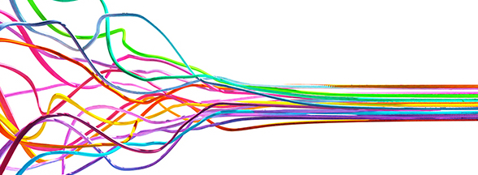

```{r setup, include=FALSE}
knitr::opts_chunk$set(echo = FALSE,
                      cache = T)
library(pacman)
p_load(tidyverse, tidytext, tm, quanteda,
       knitr, kableExtra, rio)
```

```{r show-img}

```

## Two meaningful words

There is a theory that the combined frequencies of *and* and *but* correlate to the success of a political speech as a communicative action. Why is this? Both *and* and *but* are coordinating conjunctions, i.e. they are used to combined clauses into longer sentences. Unless you are going to have a very simple sentence with just one subject and one predicate, you will need to use a conjunction. Arguably, *and* and *but* are the simplest of all conjunctions.

```{r get-data}
corpus <- import("../../data/corpus.RDS") %>% 
  unnest_tokens(word, text)
```

```{r get-andbut}
andbut <- c("and", "but")
other_coord <- c("for", "nor", "or", "yet", "so")
subord <- c("once", "after", "as",
         "while", "when", "whereas", 
         "whenever", "wherever",
         "whether", "how", "if", "though",
         "because", "before", "until", 
         "unless", "since", "so")
total <- 
  corpus %>% 
  count(doc_id) %>% 
  rename(total = n)

conjunctioncounts <- 
  corpus %>% 
  count(doc_id, word) %>% 
  left_join(total) %>% 
  mutate(freq=n/total*1000) %>% 
  filter(word %in% andbut | word %in% other_coord |
           word %in% subord)

andbutcounts <- 
  conjunctioncounts %>% 
  filter(word %in% andbut) 

andbutcounts %>% 
  kbl() %>% 
  kable_paper()
```

```{r viz-andbut}
pal <- wesanderson::wes_palette("Darjeeling2", 4)
andbutcounts %>% 
  ggplot(aes(x=word,
             y=freq,
             fill=doc_id)) +
  geom_col(
    position = "dodge",
    width = .45,
    show.legend = F
    ) +
  scale_fill_manual(values = pal) +
  theme_bw(base_family = "Volkhov-Regular",
                  base_size = 10) +
  facet_wrap(~doc_id, nrow=1)

```

We see that *and* and *but a*re most frequent in the latter Bush's speeches. So tentatively, he is the one who most embraces simple (clear?) rhetoric.

## A look at all connectors in comparison

But the occurrence of *and* and *but* depends on other aspects of the language used, e.g. how many sentences are used, how many connectors are in text overall, etc. *And* and *but* are in a group of other coordinators.

#### English coordinating conjunctions

-   For
-   And
-   Nor
-   But
-   Or
-   Yet
-   So

(Mnemonic: FANBOYS.)

And then there are the subordinating conjunctions, which are used to construct sentences that are syntactically complex.

#### English subordinating conjunctions

-   O = only if, once
-   N = now that
-   A = although, after, as
-   W = while, when, whereas, whenever, wherever, whether
-   H = how
-   I = if, in case, in order that
-   T = though
-   E = even though, even if
-   B = because, before
-   U = until, unless
-   S = since, so, so that

(Mnemonic: ON A WHITE BUS.)

So to gain perspective let's visualize three figures per speech:

-   the aggregate frequency of *and/but,*

-   all other coordinators combined, and

-   all subordinators combined.

```{r viz-conj-groups, layout="l-body-outset"}
conjgroups <- 
  conjunctioncounts %>% 
  mutate(group = 
           case_when(word %in% andbut ~ "and/but",
                     word %in% other_coord ~ "other coordinators",
                     TRUE ~ "subordinators")) 

conjgroups <- 
  conjgroups %>% 
  count(doc_id, group) %>% 
  left_join(total) %>% 
  mutate(freq = n/total*1000)

conjgroups %>% 
  ggplot(aes(x = group,
             y = freq,
             fill = doc_id)) +
  geom_col(show.legend = F,
           width = .45,
           position = "dodge") +
  facet_wrap(~doc_id, nrow = 1) +
  scale_fill_manual(values=pal) +
  labs(
    title = "Conjunctions in Texan Inaugurals",
    x = "",
    y = "per 1,000 words",
    caption = "www.texasenglish.org") +
  theme_bw(base_family = "Volkhov-Regular",
                base_size = 10) +   
  theme(axis.text.x = element_text(angle=25,
                                   vjust=0.6),
        axis.title.y = element_text(size=8))

```

Here, then, is the real finding. The *and/but* comparison is really not what distinguishes these three presidents, or the four speeches. By far the most notable change is that Bush 43, in his second inaugural address, decreases his use of *subordinators* compared to previous Texan inaugurals, *but not of* and *or* but*.*

And this is despite the fact that the second inaugural of Bush 43 had longer sentences on average than any of the others, as we saw [in this post](https://texan-inaugurals.netlify.app/posts/2-numeric-measures/).

So we might say: after 9-11, Bush's messaging has tightened up and simplified notably. He has lost 25% of his subordinating conjunctions -- that's a very significant drop in the world of corpus linguistics.

<aside>

You could call this shift dramatic without being wrong.

</aside>
