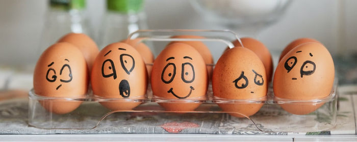

```{r setup, include=FALSE}
knitr::opts_chunk$set(echo = FALSE,
                      cache = TRUE,
                      cache.lazy = FALSE)
library(pacman)

p_load(rio, dplyr, ggplot2, stringr, knitr, 
       kableExtra, beepr, tidytext)

corpus <- import("data/corpus_postagged.RDS")
```

{width="60%"}

## Overall sentiment

In sentiment analysis, each word is scored for its emotional base value. Some words have a positive core, others negative. Not all words are recognized as conveying emotion: only a little under 10% of all words receive a score, at least that's the case with these speeches.

### Global Scores per Speech

The first plot gives a comparison of pos. and neg. scores for each inaugural.

```{r viz-sentiment}
n_total <- 
  corpus %>% 
  count(doc_id) %>% 
  rename(total = n)

corpus_sent <- 
  corpus %>% 
  mutate(word = tolower(token)) %>% 
  anti_join(stop_words) %>% 
  left_join(get_sentiments("bing"))

n_sent <- 
  corpus_sent %>% 
  count(doc_id, sentiment) %>% 
  na.omit() %>% 
  left_join(n_total) %>% 
  mutate(sent_norm = n/total*1000)

pal <- wesanderson::wes_palette("Cavalcanti1", 2, type = "discrete")

n_sent %>% 
  mutate(sentiment = factor(sentiment, levels = c("positive", "negative"))) %>% 
  ggplot(aes(doc_id, sent_norm, 
             group = sentiment, 
             fill = sentiment)) +
  geom_col() +
  scale_fill_manual(values = pal) +
  labs(
    title = "Emotionally Loaded Words in Texan Inaugurals",
    subtitle = "Frequencies per 1,000 words",
    x = NULL, y = NULL,
    caption = "www.texasenglish.org"
  ) +
  theme_bw(base_family = "Volkhov-Regular",
           base_size = 10) +
  theme(#legend.title       = element_blank(),
        panel.grid.major.x = element_blank(),
        panel.grid.minor.x = element_blank(),
        plot.title.position = "plot",
        plot.caption = element_text(hjust = 0),
        plot.caption.position =  "plot")
```

## Most Frequent Sentiment Terms

### Top  Positive Terms

The following plot shows the most frequent positive-scored terms for each speech together with its number of occurrences.^[Shown are the top-6 ranked terms for each speech. Sometimes there are ties for ranks.]

```{r top-pos-terms, layout="l-body-outset", fig.cap="Sentiment analysis: top-ranked positive terms.", fig.height=6}
terms_pos <- 
  corpus_sent %>% 
  filter(sentiment == "positive") %>% 
  mutate(lemma = tolower(lemma)) %>% 
  group_by(doc_id, lemma) %>% 
  summarise(mentions = n()) %>% 
  left_join(n_total) %>% 
  mutate(freq = mentions/total*1000) %>% 
  ungroup() 

terms_pos <- 
  terms_pos %>% 
  group_by(doc_id) %>% 
  top_n(6) %>% 
  ungroup() %>% 
  arrange(doc_id, freq) %>%
  mutate(order = row_number())

pal <- wesanderson::wes_palette("Darjeeling2", 4, type = "discrete")

terms_pos %>% 
  ggplot(aes(order, freq, fill=doc_id)) +
  geom_col(show.legend = F) +
  scale_fill_manual(values = pal) +
  labs(title = "Most Frequent Positive Sentiment Words in Texan Inaugurals",
       subtitle = "Frequencies per 1,000 words",
       x = NULL, y = NULL, caption = "www.texasenglish.org") +
  scale_x_continuous(
    breaks = terms_pos$order,
    labels = terms_pos$lemma,
    expand = c(0,0)
  ) +
  facet_wrap(~doc_id,
             scales = "free") +
  theme_bw(base_family = "Volkhov-Regular",
           base_size = 10) +
  theme(panel.grid.major.y = element_blank(),
        panel.grid.minor.y = element_blank(),
        plot.title.position = "plot",
        plot.caption = element_text(hjust = 0),
        plot.caption.position =  "plot"
        ) +
  coord_flip()

```


### Top Negative Terms

Below follows the same visualization as above, but for the terms with negative semantic loads.

```{r top-neg-terms, layout="l-body-outset", fig.cap="Sentiment analysis: top-ranked negative terms.", fig.height=6}
terms_neg <- 
  corpus_sent %>% 
  filter(sentiment == "negative") %>% 
  mutate(lemma = tolower(lemma)) %>% 
  group_by(doc_id, lemma) %>% 
  summarise(mentions = n()) %>% 
  left_join(n_total) %>% 
  mutate(freq = mentions/total*1000) %>% 
  ungroup() 

terms_neg <- 
  terms_neg %>% 
  group_by(doc_id) %>% 
  mutate(linenumber = row_number()) %>% 
  ungroup() %>% 
  filter(linenumber < 7) %>% 
  arrange(doc_id, mentions) %>%
  mutate(order = row_number())

terms_neg %>% 
  ggplot(aes(order, freq, fill=doc_id)) +
  geom_col(show.legend = F) +
  scale_fill_manual(values = pal) +
  labs(title = "Most Frequent Negative Sentiment Words in Texan Inaugurals",
       subtitle = "Frequencies per 1,000 words",
       x = NULL, y = NULL, 
       caption = "www.texasenglish.org") +
  facet_wrap(~doc_id,
             scales = "free") +
  theme_bw(base_family = "Volkhov-Regular",
           base_size = 10) +
  theme(panel.grid.major.y = element_blank(),
        panel.grid.minor.y = element_blank(),
        plot.title.position = "plot",
        plot.caption = element_text(hjust = 0),
        plot.caption.position =  "plot"
        ) +
    scale_x_continuous(
      breaks = terms_neg$order,
      labels = terms_neg$lemma,
      expand = c(0,0)
  ) +
  coord_flip()

```

## Positive-to-Negative Ratio

The following plot shows the pos:neg ratio for the speeches.

```{r pos-neg-ratio}
n_sent %>% 
  select(-sent_norm) %>% 
  tidyr::pivot_wider(
    names_from = sentiment,
    values_from = n
  ) %>% 
  mutate(ratio = positive/negative) %>% 
  #----------#
  ggplot(aes(doc_id, ratio,
             fill = doc_id)) +
  geom_col(width = .4,
           show.legend = F) +
  scale_fill_manual(values = pal) +
  labs(title = "Sentiment Ratio in Texan Inaugurals",
       subtitle = 
         expression(italic("N") [positive] / italic("N") [negative]),
       x=NULL,
       caption = "www.texasenglish.org") +
  theme_bw(base_family = "Volkhov-Regular",
           base_size = 10) 
```


## Interpretation

Once again, 2005-Bush stands out: it has by far the highest frequency of emotionally loaded terms out of all four speeches. When we look closer, we see that much of this is attributable to the hyper-frequent use of **freedom** and **free**.

All four speeches are reticent when it comes to negative terms. This must be due to that good old American optimism that we're seeing. 