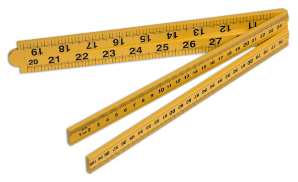

```{r setup, include=FALSE}
knitr::opts_chunk$set(echo = FALSE,
                      cache = T)
library(pacman)
p_load(tidyverse, tidytext, tm, quanteda,
       knitr, kableExtra, rio)
```

```{r load-data}
corpus <- import("../../data/corpus.RDS")
```

```{r img}

```
